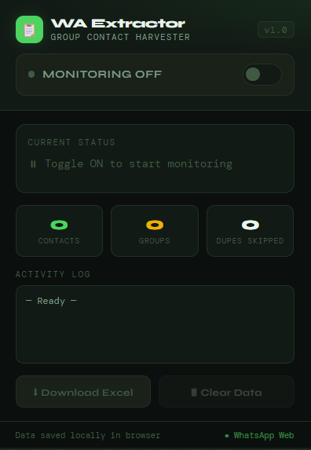
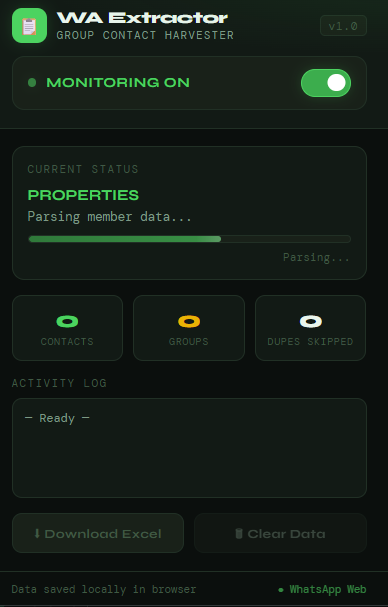
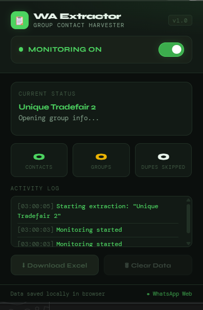

# WhatsApp Group Extractor 📋

<div style="display: flex;">



</div>

<br>
A powerful Chrome extension that automatically extracts contact names and phone numbers from WhatsApp Web groups. Perfect for lead generation, contact management, and building email lists from group members.

## Features

- 🤖 **Automatic Extraction** - Monitor groups and automatically extract member data
- 📊 **Excel Export** - Download all contacts in a professionally formatted Excel file with per-group sheets
- ✨ **Real-time Monitoring** - Toggle extraction on/off and watch it work across groups
- 📁 **Local Storage** - All data is stored securely in your browser (no cloud sync)
- 🎯 **Duplicate Detection** - Automatically skips duplicate contacts
- 📈 **Live Stats** - Real-time tracking of contacts, groups, and duplicates

## Requirements

- **Chrome Browser** (v90+)
- **Node.js** v14.x or higher
- **npm** v6.x or higher
- **Python** v3.7+ (for build scripts only)

## Installation & Local Setup

### Step 1: Clone the Repository

```bash
git clone https://github.com/Loluwafemi/wa_extra.git
cd wa_extra
```

### Step 2: Install Dependencies

```bash
npm install
pip install -r requirements.txt
```

### Step 3: Load the Extension in Chrome

1. Open Chrome and go to `chrome://extensions/`
2. Enable **Developer Mode** (toggle in top right)
3. Click **Load unpacked**
4. Select the `whatsapp-extractor` folder from this repository
5. The extension icon (📋) should now appear in your toolbar

### Step 4: Start Using

1. Go to [https://web.whatsapp.com](https://web.whatsapp.com)
2. Open any group chat
3. Click the extension icon in your toolbar
4. Toggle **MONITORING ON** to start extracting
5. The extension automatically captures member data as you browse groups
6. Click **Download Excel** to export your collected contacts

## How It Works Locally

The extension runs entirely in your browser with three main components:

### **manifest.json**
Defines extension permissions, content scripts, and UI configuration for Chrome.

### **content.js**
The core extraction engine that:
- Detects when you switch to a group chat
- Opens the group info panel
- Scrolls through the member list
- Extracts name and phone number data
- Saves data to browser storage

### **popup.html & popup.js**
Provides the user interface with:
- Toggle to start/stop monitoring
- Live extraction status and progress
- Statistics (contacts found, groups scanned, duplicates skipped)
- Activity log
- Download and clear buttons

### **lib/xlsx.min.js**
Bundled SheetJS library for generating Excel files with:
- "All Contacts" sheet with complete data
- Individual sheets per group

## Usage

### Basic Workflow

1. **Enable Monitoring**: Toggle the switch in the popup to ON
2. **Browse Groups**: Navigate between different WhatsApp groups
3. **Auto-Extract**: The extension automatically captures members from each group
4. **Export**: Click "Download Excel" when ready to get your contacts

### Popup Dashboard

- **Status**: Shows current monitoring state and active group
- **Stats**: 
  - Green (Contacts): Total unique contacts extracted
  - Amber (Groups): Number of groups scanned
  - Gray (Dupes): Duplicate entries skipped
- **Activity Log**: Real-time extraction events and errors
- **Download Excel**: Export as `WA_Contacts_YYYY-MM-DD.xlsx`
- **Clear Data**: Reset all collected data

## Build Scripts

Located in `/scripts`:

### Generate Icons
```bash
pip install pillow --break-system-packages -q && python3 scripts/make_icons.py
```

### Create Documentation
```bash
python3 scripts/make_docs.py
```

### Package Extension
```bash
zip -r ./output/io.whatsapp-extractor.zip whatsapp-extractor/
```

## Project Structure

```
wa_extra/
├── whatsapp-extractor/           # Chrome extension files
│   ├── manifest.json             # Extension configuration
│   ├── popup.html                # UI interface
│   ├── popup.js                  # UI logic
│   ├── content.js                # Core extraction engine
│   ├── background.js             # Background service worker
│   ├── lib/
│   │   └── xlsx.min.js           # SheetJS library
│   └── icons/                    # Extension icons
├── scripts/                      # Build & utility scripts
│   ├── make_icons.py            # Icon generation
│   ├── make_docs.py             # Documentation generator
│   └── readme.md                # Scripts documentation
├── requirements.txt              # Python dependencies
└── README.md                     # This file
```

## Troubleshooting

### Extension not extracting data?
- Ensure you're on **WhatsApp Web** (`web.whatsapp.com`)
- Open a **group chat** (not 1-on-1 conversations)
- Check the Activity Log in the popup for error messages
- Refresh the page and try again

### No contacts appearing?
- WhatsApp may have updated its UI - check logs for specific selectors
- Ensure you scroll through the entire member list before downloading
- Verify group has members visible in the member panel

### Excel file won't download?
- Check browser download settings
- Disable any popup blockers
- Try clearing browser cache and reloading

## Privacy & Security

- ✅ All data stored **locally** in your browser
- ✅ No data sent to external servers
- ✅ No backend dependencies
- ✅ Clear data anytime with the "Clear Data" button

## Limitations

- Only works on **WhatsApp Web** (not mobile app)
- Extracts only visible member data from group info panel
- Phone numbers must be saved in member's contact info
- Chrome extension only (not Firefox, Edge, Safari)

## Development

### How to Test Locally

1. Make changes to files in `whatsapp-extractor/`
2. Reload the extension: Go to `chrome://extensions` and click the refresh icon
3. Test on `web.whatsapp.com`
4. Check popup console for debugging: Right-click popup → Inspect

### Modifying Extraction Logic

The main extraction selectors are in `whatsapp-extractor/content.js`:
- `getCurrentGroupName()` - Gets group title
- `isGroupChat()` - Detects if chat is a group
- `parseMemberNodes()` - Extracts member data

If WhatsApp updates their UI, these selectors may need adjustment.
[we want to create an ai model e.g gemma-4 that can automatically update the ui logic whenever whatsapp updates their ui.]

## Contributing

Contributions welcome! Areas for improvement:
- Support for more messaging platforms
- Enhanced duplicate detection
- Data filtering and search
- Cloud sync options (optional)

## License

MIT License - Feel free to use and modify

---

**Made with 🩸&😥💦 by Loluwafemi**

Last updated: May 6, 2026
